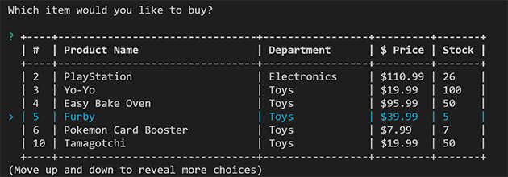
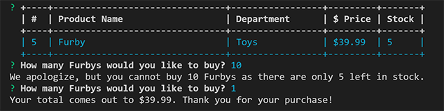
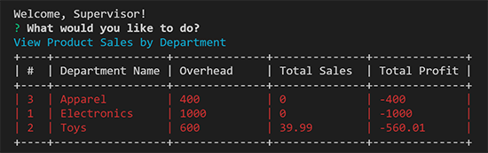
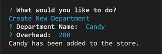

# Bamazon

## Usage
### Customer View (bamazonCustomer.js)
- Let's visit the Bamazon store.

- Buy an item


### Manager View (bamazonManager.js)
- Managing inventory for the Bamazon store (products in red are low)

(you can also view a separate list of only inventory that is low.)
- Add inventory

- Add a new product


- Adding a new product with the same name as an existing product will try to resolve the conflict


### Supervisor View (bamazonSupervisor.js)
- Supervising the store's sales (departments in red are losing money)

- Add a department
 

## To Install
1. Use the included schema.sql file to create the "bamazon" database.
- note: if a database already exists with this name, please edit these lines in schema.sql:
```
CREATE DATABASE bamazon;
USE bamazon;
```
to CREATE and USE a different name of your choice. but **remember this name!**
- Feel free to remove the INSERT statements too, if you don't want the products I've supplied.

2. Edit the files bamazonCustomer.js, bamazonManager.js, and bamazonSupervisor.js near the top where it says:
```
var connection = mysql.createConnection({
	host: "localhost",
	port: 3306,
	user: "root",
	password: "password",
	database : "bamazon"
});
```
Replacing the information with your own MySQL information.  If you're running it locally, this will probably mean at least changing the password to the password for your database. (If you changed the database name in step 1, make sure you change it here too.)

3. Run
```
$ npm install
```

4. Run the js files from the terminal.

## Packages in use
- [npm colors](https://www.npmjs.com/package/colors)
- [npm mysql](https://www.npmjs.com/package/mysql)
- [npm inquirer](https://www.npmjs.com/package/inquirer)